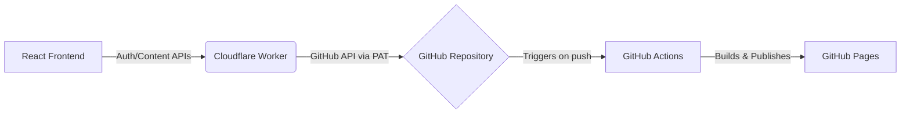

# Noble Education GitOps Headless CMS

Noble Education GitOps Headless CMS is a modern content management system that leverages GitHub as the single source of truth for content, paired with a React frontend and a Cloudflare Worker for secure API interactions.


## Architecture Overview



## Prerequisites

- Node.js version 20+
- Git installed locally
- Cloudflare account (for Cloudflare Workers)
- GitHub Personal Access Token (PAT) with repository write access

## Quick Start (Local Development)

1. Clone the repository:
   ```bash
   git clone https://github.com/jekipansuriya2394/interactive-education-platform.git
   cd interactive-education-platform
   ```
2. Install dependencies:
   ```bash
   npm install
   ```
3. Create a `.env` file based on `.env.example` and set up environment variables.
4. Start the local development server:
   ```bash
   npm run dev
   ```

## Environment Variables

For the React frontend, configure the following in your `.env`:

- `VITE_WORKER_URL`: The URL of your deployed Cloudflare Worker (e.g., `https://api.yourdomain.workers.dev`).
- `VITE_GH_OWNER`: Your GitHub username or organization name.
- `VITE_GH_REPO`: The GitHub repository name.

## Cloudflare Worker Deployment

Follow these steps to deploy the Cloudflare Worker which acts as the API backend:

1. Navigate to the worker directory:
   ```bash
   cd worker
   ```
2. Login to Wrangler CLI:
   ```bash
   npx wrangler login
   ```
3. Store your GitHub Personal Access Token (PAT):
   ```bash
   npx wrangler secret put GH_PAT
   ```
4. Store a secure JWT Secret:
   ```bash
   npx wrangler secret put JWT_SECRET
   ```
5. Configure Admin Users via JSON:
   ```bash
   npx wrangler secret put ADMIN_USERS
   ```
   *Format example:* `[{"username":"admin","hash":"<sha256_hash>","role":"Super Admin"}]`
6. Deploy the worker:
   ```bash
   npx wrangler deploy
   ```

## GitHub Secrets Setup

To enable seamless deployments via GitHub Actions, configure the following secrets in your GitHub repository (Settings > Secrets and variables > Actions):

- `VITE_WORKER_URL`: The deployed Cloudflare Worker URL.

## Admin Panel Usage

- **URL:** Navigate to `/admin` on your deployed application.
- **Credentials:** Use the username and password corresponding to the `ADMIN_USERS` configured in the worker.

## Content System

Content is managed entirely through JSON files located in the `content/` directory (e.g., `content/pages.json`, `content/blog/*.json`). This GitOps approach ensures all changes are versioned and auditable.

## Media Uploads

Media files can be uploaded via the Admin Panel. 
- **Size Limit:** Recommended maximum upload size is 5MB to ensure optimal Git repository size and performance.
- **Conversion:** Images are processed and recommended to be in WebP format for fast web delivery.

## Roles & Permissions

| Role | Permissions |
| :--- | :--- |
| **Super Admin** | Full access to all content, user management, and system settings. |
| **Admin** | Create, edit, and publish content. Manage media uploads. |
| **Editor** | Draft and edit content only. |
| **Viewer** | Read-only access to the admin dashboard. |

## Security Notes

- Authentication is managed via JSON Web Tokens (JWT).
- **Never expose your GitHub PAT in the frontend.** All GitHub API interactions happen securely via the Cloudflare Worker.

## Contributing & License

Contributions are welcome! Please open an issue or submit a pull request.
Licensed under the MIT License.
